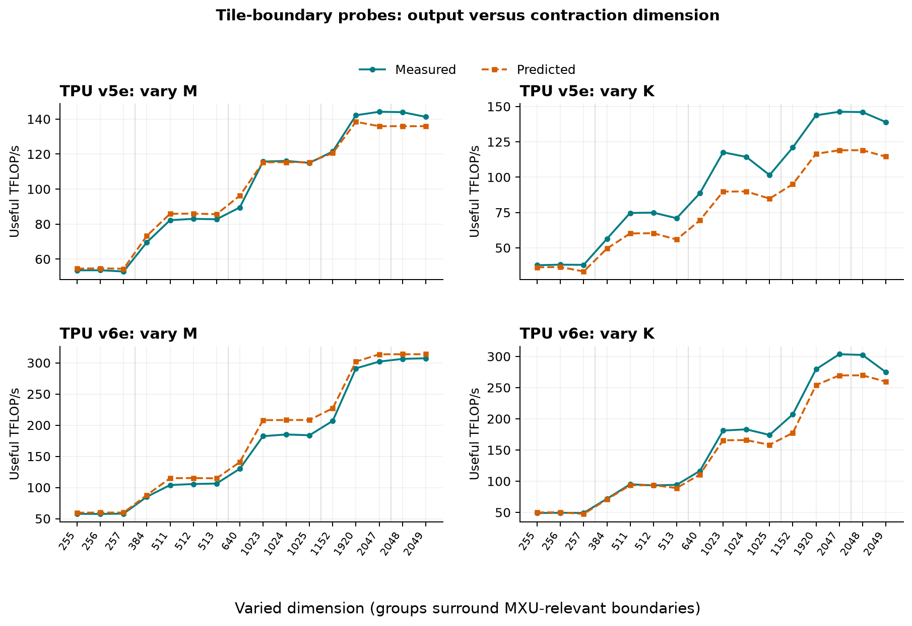
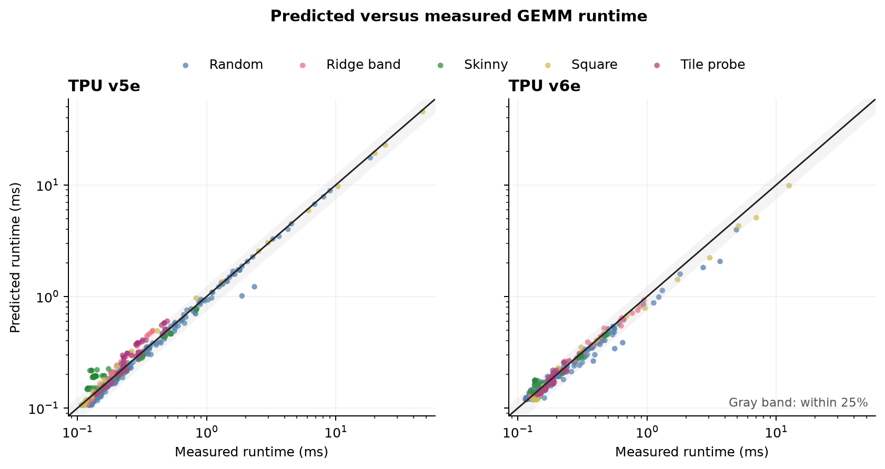
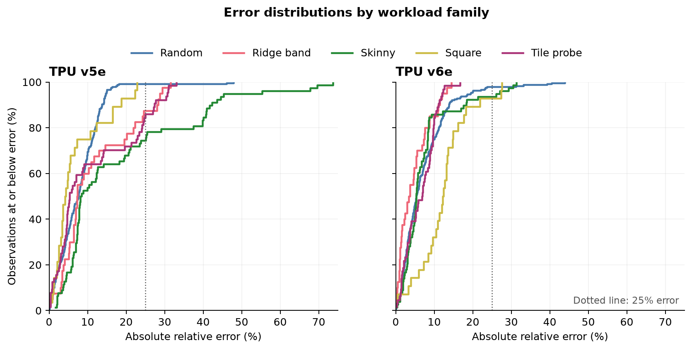

## Raise the Roofline

TPU GEMM performance should be easy to model. We've got rooflines, we've got the JAX Scaling Book, and we've got spec sheets. So why then is it such a nuisance to predict the runtime of a GEMM given a description of the hardware? Below, we dig into the operation that TPUs are designed around.

To be explicit, the problem that we're trying to answer is:
> Given `M`, `N`, `K`, an input dtype, and a hardware description, how long does `C[M,N] = A[M,K] @ B[K,N]` take on one TPU chip?

We begin by adapting a traditional roofline model, where we estimate FLOPs, memory reads/writes, and use the provided hardware rates to determine workload characteristics. Hardware descriptions are sourced from JAX [tpu_info.py](https://github.com/jax-ml/jax/blob/91eac725cd1070fc0429995629313ea9c08c1ade/jax/_src/tpu_info.py). These values are consolidated into spec files containing:

- Peak FLOP/s
- HBM bandwidth
- MXU dimension(s)
- VMEM capacity

Additional quantities consumed by the model(s) are dtype tiling and launch overhead, the latter being measured during data collection. We use `jnp.dot` as our GEMM interface, deferring memory management, pipelining, etc. decisions to XLA in exchange for a consistent implementation interface.

We use the following values for initial calculations:

```text
Mp, Np, Kp = round_up(M, N, K, mxu_dim) -> padded dims
FLOPs      = 2 * Mp * Np * Kp -> FLOPs with padded dims
Tc         = FLOPs / peak_flops[dtype] -> Compute volume
```

Both bf16 (fp32 accumulation) and int8 (int32 accumulation) are tested to gather information about data-dependent packing and throughput.  The model accounts for array tiling using layout granularities sourced from TPU docs. For bf16, f32, and int32 padding rounds values up to multiples of `(8, 128)`, while int8 is padded to `(32, 128)`.

Memory is modeled with two reads (A and B) and one write (C). However, we adjust our modeled memory volume when the problem size exceeds VMEM capacity. We choose the largest square block `b` that fits, using it to estimate input rereads:

```python
if bytes(A) + bytes(B) + bytes(C) <= vmem:
    modeled_bytes = bytes(A) + bytes(B) + bytes(C)
else:
    reread_factor = (2MN / b) / (M + N)
    modeled_bytes = reread_factor * (bytes(A) + bytes(B)) + bytes(C)


Tm      = modeled_bytes / hbm_bandwidth
runtime = measured_launch_floor + max(Tc, Tm)
```

## Data Collection

450 shape variations were generated across five families. All shapes were tested on single device v5e/v6e instances in GCP Cloud TPU VMs.

| Family | Purpose | Experiments per SKU |
|---|---|---:|
| random | broad shape coverage, including deliberately misaligned dimensions to prevent overfitting | 240 |
| skinny | decode-like, stresses launch overhead, output traffic, and accumulator residency | 78 |
| tile probe | values immediately around MXU boundaries | 64 |
| ridge band | arithmetic intensity around the SKU's roofline ridge point | 40 |
| square | conventional size ladder in both dtypes | 28 |

Each configuration is compiled and warmed up for five iterations. Operations are then timed over 20 iterations, recording the median and the IQR in [data/measurements.csv](../data/measurements.csv).

We use median absolute relative error to capture typical error sizes, p90 absolute relative error to capture tail error, and geometric bias to measure the model's tendency to over/underpredict.

``` text
ratio_i = predicted_i / measured_i
geometric_bias = exp(mean(log(ratio_i)))
```

A geometric bias of 0.90x indicates our predictions are 10% too low across a multiplicative average, so the model expects the computation to finish sooner than observed. Similarly, 1.10x means predicted runtimes are 10% longer than observed.

## Initial Evaluation

Our first round of testing produced median absolute errors of 9.3% on v5e, and 8.9% on v6e. We proceed by probing residuals per family to characterize modeling deficiencies.

### Ridgeline Probes

The first model combines compute and memory time using `max(Tc, Tm)`, which assumes perfect overlap. "Near the ridgeline" here means neither term exceeds the other by more than a factor of two, or concretely `0.5 <= Tc/Tm <= 2.0`. In this range, model estimates have geometric biases of 0.947x (v5e) and 0.902x (v6e). Because `max(Tc, Tm)` discards the smaller term, these biases are consistent with unmodeled pipeline fill/drain.

### Skinny Shapes

In v5e measurements, small `M` with large `N=K` runtimes approximate the time it takes to simply stream B from memory, nearly independent of `M`. The model predicts input rereads when `(bytes(A) + bytes(B) + bytes(C)) > vmem_capacity`, so these residuals suggest the output accumulator can remain resident with buffered inputs when full operands can't. This would allow B to stream through only once.

### Tiling Probes

For a boundary `b`, we compute `penalty = 1 - useful_throughput(b + 1) / useful_throughput(b)`, where useful throughput is `2MNK / measured_runtime` rather than raw runtime. Observations with near zero penalties indicate that the runtime grew in proportion to the FLOPs. Positive values indicate the runtime grew faster than the useful work, and negative values imply throughput improved, potentially attributable to noise or a separate scheduling effect. This suggests that output grid remainders in `M` and contraction remainders in `K` are handled differently.

| Boundary crossing (bf16) | V5e measured penalty | V6e measured penalty |
|---|---:|---:|
| M: 512 to 513 | 0.3% | -0.7% |
| M: 1024 to 1025 | 1.0% | 0.7% |
| M: 2048 to 2049 | 1.9% | -0.3% |
| K: 512 to 513 | 5.3% | -0.9% |
| K: 1024 to 1025 | 11.2% | 4.9% |
| K: 2048 to 2049 | 4.8% | 9.1% |

We initially assume a full, additional MXU tile when any of `M`, `N`, `K` cross a tile boundary. Useful throughput across `M` boundaries changes less than 2%, while the penalty across `K` boundaries produces more significant penalties. Uniform treatment across dimension tiles is thus unsupported by our observations.



*Figure 1. Useful throughput around selected output (`M`) and contraction (`K`) boundaries. Because useful throughput excludes padded work, extra tile work appears as a downward step. The teal series is measured while the orange series is the final contraction-only model, not the initial all-dimension model. The contraction crossings motivate rounding `K`, while equivalent output crossings are small and inconsistent.*

## Calibration

Following these results, we first fit a 4 parameter model to try and explain the residuals. These parameters attempt to capture compute efficiency (eta_compute), memory efficiency (eta_memory), interpolation between `Tc + Tm` and `max(Tc, Tm)` p (sharpness), and launch overhead.

``` text
effective_compute_rate = eta_compute * peak_flops
effective_memory_rate  = eta_memory  * hbm_bandwidth

Tc = modeled_FLOPs / (eta_compute * peak_flops)
Tm = modeled_bytes / (eta_memory * hbm_bandwidth)

runtime = overhead + smoothmax(Tc, Tm, sharpness)
```

In this formulation, we can think of eta_compute as a term summarizing sustained compute relative to nominal peak, absorbing issue gaps, compiler scheduling, and non-MXU work, and eta_memory as summarizing sustained bandwidth relative to nominal HBM bandwidth, while also compensating for errors in the memory estimation.

For each SKU, shapes were assigned to the fit/holdout set using a stable hash of `(M, N, K, dtype)`. The per family counts were:

| SKU | Family | Fit | Held Out | % Fitted |
|---|---|---:|---:|---:|
| v5e | random | 111 | 129 | 46% |
| v5e | ridge | 22 | 18 | 55% |
| v5e | skinny | 32 | 46 | 41% |
| v5e | square | 16 | 12 | 57% |
| v5e | tile probe | 31 | 33 | 48% |
| v6e | random | 111 | 129 | 46% |
| v6e | ridge | 20 | 20 | 50% |
| v6e | skinny | 32 | 46 | 41% |
| v6e | square | 16 | 12 | 57% |
| v6e | tile probe | 31 | 33 | 48% |

The results of the fitted models on the held out data were:

| SKU | model | median error | p90 error | geometric bias |
|---|---|---:|---:|---:|
| v5e | initial model | 9.7% | **25.3%** | 0.961x |
| v5e | four constant calibration | **3.1%** | 47.2% | 1.077x |
| v6e | initial model | 8.6% | **21.4%** | 0.959x |
| v6e | four constant calibration | **6.1%** | 22.4% | 1.021x |

With fitted values:

| SKU | compute efficiency | memory efficiency | overhead | sharpness |
|---|---:|---:|---:|---:|
| v5e | 0.97 | 0.80 | 116 us | 8 |
| v6e | 0.84 | 0.84 | 119 us | 6 |

The smooth-max sharpness operation interpolates smoothly between `Tc + Tm` and `max(Tc, Tm)` with `(Tc^p + Tm^p)^(1/p)`. Values range from 1 to infinity, where p=1 reduces to `Tc + Tm`, and p->inf reduces to `max(Tc, Tm)`. The following values were swept to produce a fit: `[1, 1.25, 1.5, 2, 2.5, 3, 4, 6, 8, 12, 20, infinity]`.

Analyzing the tail residual behavior in v5e, calibration cut median error from 9.7% to 3.1%, but nearly doubled p90 error to 47.2%. Fitted bandwidth efficiency pushed skinny shape predictions further from observed values. Constants improved well-tuned components of the modified roofline model, but amplified errors in poorly modeled components.

## Deriving Modifications

| Initial assumption | Evidence | Interpretation | Revision |
|---|---|---|---|
| Total working set above VMEM forces rereads | Skinny runtime tracks one stream of B | A small accumulator can remain resident | Add a resident-accumulator traffic branch |
| Compute and memory overlap perfectly | Near-ridge geometric bias | Small block grids have pipeline fill/drain cost | Derive overlap from block count |
| All dimensions pay full MXU remainder work | `M` crossings are cheap `K` crossings are not | Partial outputs and partial contractions lower differently | Round only `K` for arithmetic |
| Nominal peak is achievable | Compute-bound v6e is optimistic | Sustained rate is compiler- and dtype-dependent | Leave visible and propose one measured rate per dtype |

### Accumulator Resident Streaming

We first revise the memory traffic component of the model to estimate whether the accumulator jointly fits in VMEM with input panel double buffering:

```text
resident_bytes = 4MN + 2 * mxu_dim * bytes_per_input * (M + N)
```

If resident bytes fit in VMEM, we only count A and B streaming once, falling back to the initial reread estimate otherwise.

### Block-pipeline overlap

Let `n_blocks` be the number of VMEM-sized output blocks, `Tc` the aggregate compute time, and `Tm` the aggregate memory time. A double buffered pipeline costs:

```text
pipeline_time = max(Tc, Tm) + min(Tc, Tm) / n_blocks
```

The `min(Tc, Tm) / n_blocks` term models an unhidden pipeline fill/drain. If there is only one output block, there is no work to overlap and the runtime reduces to `Tc + Tm`. As the number of pipeline blocks grows, we amortize the fill/drain cost and our model approaches `max(Tc, Tm)`. Since we derive `n_blocks` from the problem size and SKU parameters, this overlap term lets us remove the fitted per-SKU sharpness parameter.

### Contraction-only arithmetic padding

We update the FLOP arithmetic to pad only the contracting dimension based on our tile probes. In other words, crossing a reduction dimension tile boundary explicitly adds an MXU accumulation step to every output tile.

```text
Kp    = ceil(K / mxu_dim) * mxu_dim
modeled_FLOPs = 2 * M * N * Kp
```

Memory layout padding is modeled separately, and is still applied to each array. This isolates arithmetic from storage and traffic bookkeeping, which operate at different granularities.

## Final model

Given an arbitrary matrix with rows and columns `(R, C)`:

```text
array_bytes = round_up(R, tile_rows[dtype])
            * round_up(C, tile_cols)
            * bytes_per_element[dtype]

reread = (2MN / b) / (M + N)
bytes  = reread * (bytes(A) + bytes(B)) + bytes(C)
```

The complete prediction is:

```text
Tc      = 2MNKp / peak_flops[dtype]
Tm      = bytes / hbm_bandwidth
runtime = launch_overhead + max(Tc, Tm) + min(Tc, Tm) / n_blocks
```

The final model contains no fitted throughput or shape-specific terms. The revisions were developed after inspecting all 900 observations, so proper validation requires an unseen SKU to evaluate the model's robustness.

## Ablations

Each candidate model uses the same measured per-SKU launch timing, so differences hold dispatch overhead constant. The baseline uses `2MNK` work, unpadded required traffic, and a hard roofline maximum. The initial model adds all-dimension MXU padding, layout padding, and the reread estimate. The next revision adds accumulator-resident traffic and block-pipeline overlap while retaining all-dimension arithmetic padding. The final stage includes those revisions, but modifies arithmetic padding, rounding `K` and not `M` or `N`.

| model stage | v5e median | v5e p90 | v5e bias | v6e median | v6e p90 | v6e bias |
|---|---:|---:|---:|---:|---:|---:|
| Roofline baseline | 10.9% | **17.9%** | 0.915x | 9.1% | 20.2% | 0.918x |
| Initial model | 9.3% | 23.3% | 0.960x | 8.9% | 21.9% | 0.955x |
| Accumulator traffic and block-pipeline overlap | **7.0%** | 23.9% | 1.003x | **5.2%** | **13.6%** | 0.978x |
| Final model (contraction-only padding) | 7.4% | 23.4% | 0.989x | 5.5% | 13.8% | 0.970x |

Accumulator-resident traffic accounting and block-pipeline overlap produce the largest reduction in median error across SKUs, though their effects are not independently isolated. The contraction-only padding produces marginally worse aggregate median error than fully padding each dimension. We opt to keep contraction-only padding rather than encode large discontinuities across `M` tiles, as our tile probes suggest the effect is marginal.

### Accuracy



*Figure 2. Final-model predictions for every measured configuration. The gray band is +/-25% and the color identifies the workload family.*

The resulting model predicts the measured workloads to 5-8% median error without shape-specific fitting. The scatter plot shows that the bulk of predictions are within 25% of the observed runtime, whereas error distributions reveal structured mispredictions.



*Figure 3. Empirical CDFs of final-model absolute relative error. Errors remain structured by family, with the longest v5e tails among skinny, tile probe, and ridge band workloads.*

The v5e mispredictions in the worst error decile are concentrated in the skinny family (22), the tile probe family (14), and the ridge band family (7).

### By Family Shape

| SKU | Family | Median Error | p90 Error | Geometric Bias |
|---|---|---:|---:|---:|
| v5e | random | 7.6% | 13.7% | 0.926x |
| v5e | ridge | 7.3% | 28.0% | 1.068x |
| v5e | skinny | 8.3% | 41.8% | 1.072x |
| v5e | square | **4.2%** | 17.2% | 1.023x |
| v5e | tile probe | 5.3% | 27.3% | 1.076x |
| v6e | random | 5.3% | 13.8% | 0.958x |
| v6e | ridge | **3.5%** | 11.1% | 0.995x |
| v6e | skinny | 5.3% | 17.8% | 1.015x |
| v6e | square | 12.3% | 19.3% | 0.899x |
| v6e | tile probe | 6.9% | **11.0%** | 0.978x |

Concretely, in the error tail for the skinny workload, the p90 error reaches 41.8% on v5e. We also observe that v6e square workload bias indicates systematic underprediction.

### By Roofline Regime

| SKU | Regime | n | Median Error | p90 Error | Geometric Bias |
|---|---|---:|---:|---:|---:|
| v5e | compute bound | 90 | 4.1% | 16.7% | 0.991x |
| v5e | memory bound | 164 | 9.9% | 27.9% | 0.980x |
| v5e | near ridge | 196 | 7.3% | 24.1% | 0.995x |
| v6e | compute bound | 17 | 16.2% | 29.8% | 0.833x |
| v6e | memory bound | 266 | 5.1% | 12.9% | 0.986x |
| v6e | near ridge | 167 | 6.0% | 13.3% | 0.958x |

The underprediction on v6e is concentrated in compute bound workloads. Geometric bias falls to 0.833x, indicating predicted runtimes are 17% too low. The model assumes nominal compute throughput but does not capture the utilization achieved by XLA.

## Remaining failure modes

### Achievable compute throughput

v5e square GEMM runtimes are consistent with advertised peak throughput, but v6e measurements only sustain 69-79% bf16 peak and 62-68% int8 peak. An added calibration may be a large, aligned GEMM per `(SKU, dtype)` to measure sustained compute.

### Rectangular blocking

On v5e the skinny shape p90 error is still 41.8%, even though the accumulator modification reduced errors in less extreme cases. When we fallback on the reread estimate, we assume square output blocks. XLA is free to choose rectangular shapes to fit the problem size, so better tiling heuristics could provide better estimates.

### Intra-block overlap

The block-pipeline formulation assigns `Tc + Tm` to v5e ridge shapes because they often fit in a single modeled output block. Real kernels are more flexible and can double buffer intra-block `K` panels. An additional modification to make pipeline granularity finer than the output grid could further improve our estimates.

The next, immediate stages of development include:

- evaluating an unseen TPU SKU
- large GEMM calibration per dtype
- inspecting XLA tiles for the worst skinny and ridge residuals
- comparing against different GEMM implementations

## Wrapping Up

It's a nuisance to predict GEMM runtimes because the software underneath has latitude to modify the particulars in unexpected ways. Starting with a roofline-based model, we identified structured failure modes based on hardware specifications and known TPU layout constraints. Using SKU-specific calibration, we identified where things were too good to be true, and followed the errors down the rabbit hole to accumulator residency, block-pipeline overlap, and `K` dimension accounting. There are always more tests to run, and more surprises around every corner.
